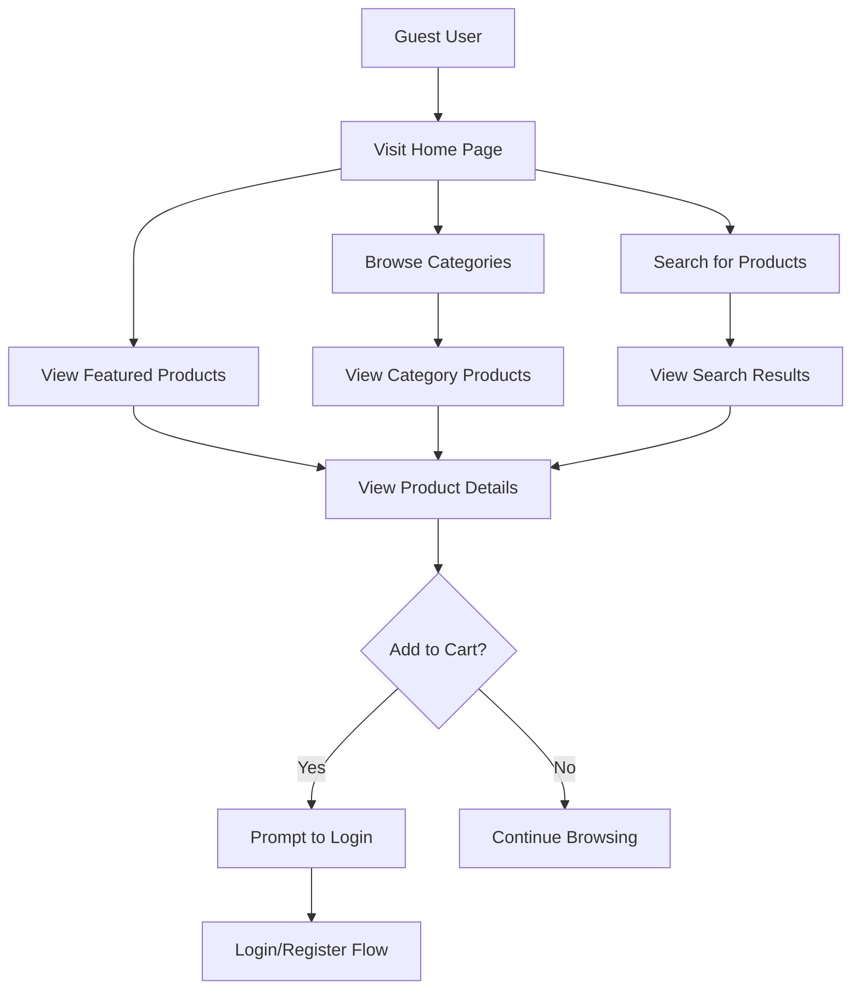
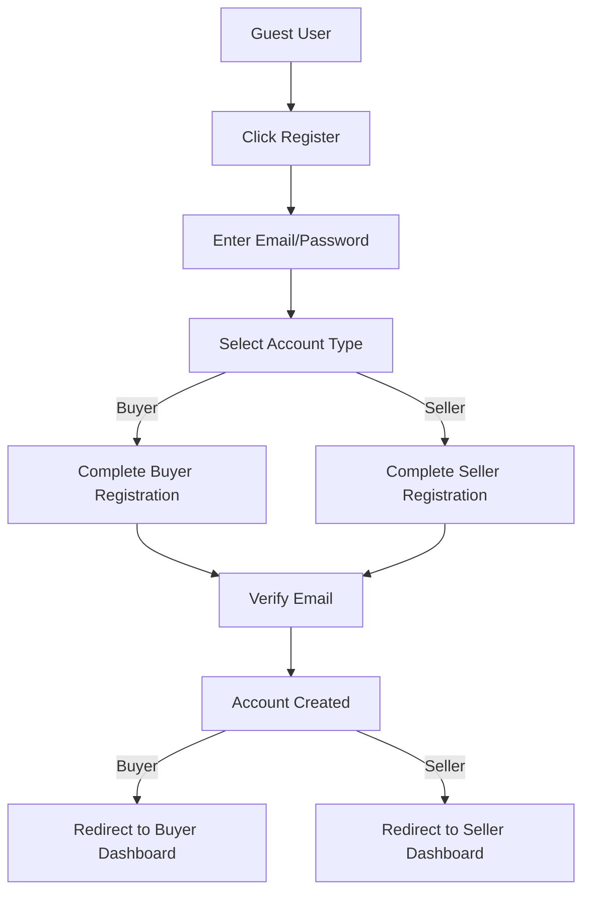
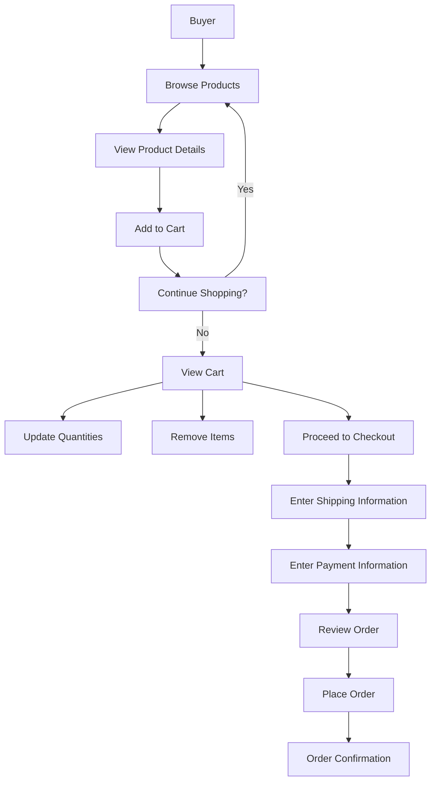
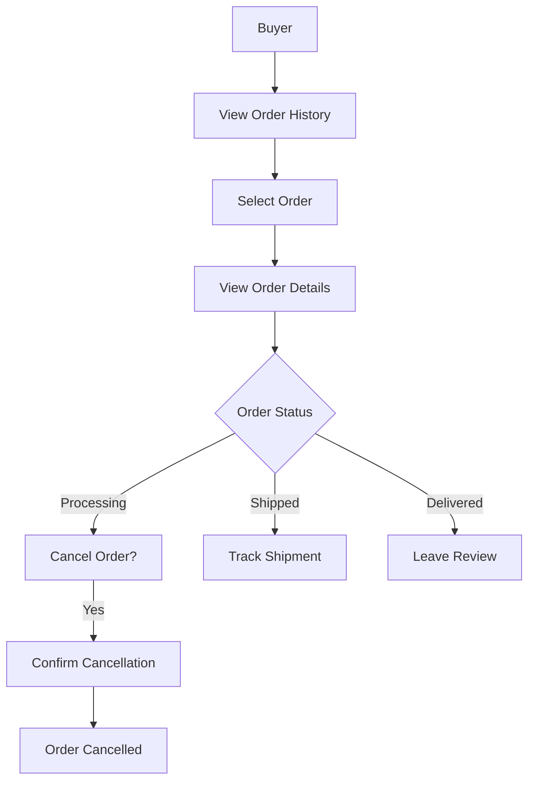
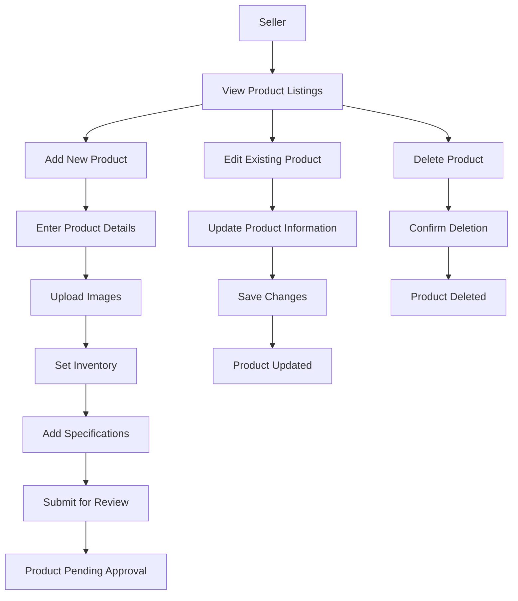
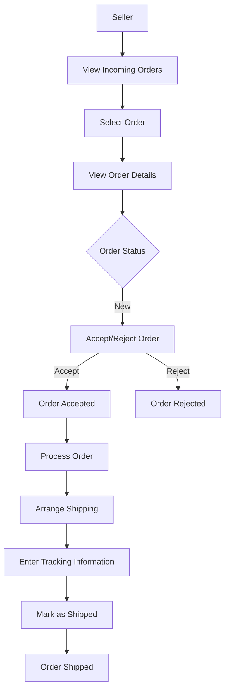
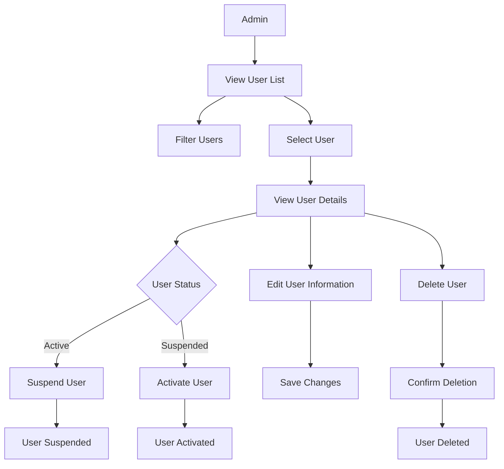
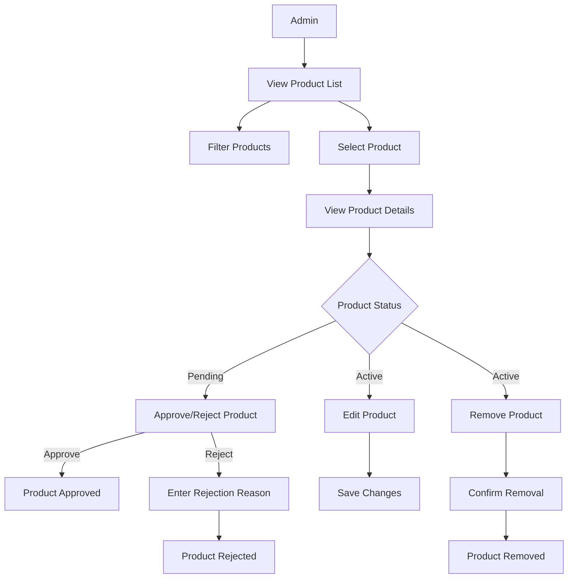
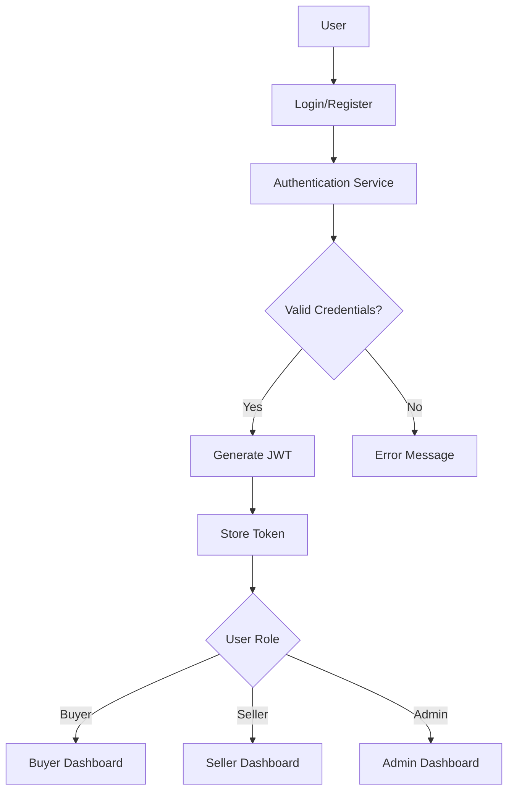
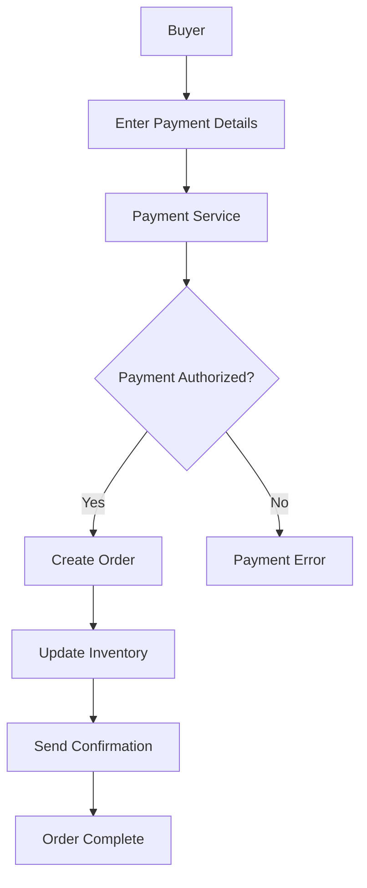

# Pickle B2B Marketplace - User Flow Diagrams

**Last Updated:** `2025-05-11`

This document provides visual representations of the key user flows in the Pickle B2B Marketplace platform.

## Guest User Flows

### Browse and View Products

### Registration Flow

## Buyer User Flows

### Shopping and Checkout

### Order Management

## Seller User Flows

### Product Management

### Order Processing

## Admin User Flows

### User Management

### Product Moderation

## Integration Points

### Authentication Flow

### Payment Processing

These diagrams provide a visual representation of the key user flows in the Pickle B2B Marketplace platform. They can be used as a reference for development, testing, and documentation purposes.
